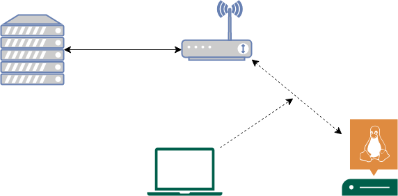

# Tesis

Repositorio de proyecto de grado sobre seguridad en un nodo IoT.

El proyecto tiene como intención verificar un nodo IoT a partir de unos estandares internacionales sobre seguridad en nodos y ecosistemas IoT. Estos estandares fueron seleccionados teniendo en cuenta el alcance de cada uno, su útilidad, especificidad y la complejidad de la infrestructura planteada.

**Estandares:**

- GSMA CLP 12 v1.0 IoT Security Guidelines for IoT Service Ecosystems
- GSMA CLP 13 v1.1 IoT Security Guidelines for Endpoint Ecosystems
- Security Standard Wireless Network (SS-019)

Se realizo una [lista](Lista_Estandares.xlsx) donde recopilaron las clausulas a evaluar según la implementación propuesta

## Ambiente de simulación

Con el objetivo de testear las clausulas elegidas y el alcance seleccionado, se propuso la siguiente arquitectura como ambiente de simulación:

**Dispositivos**:

- Raspberry Pi 3B+
- PC con SO Ubuntu
- Router TPLink TP-WA901ND

## Comm

En esta carpeta se encuentra los código referentes a las pruebas basadas en los estandares seleccionados según el protocolo de comunicaciones
en cuestión.

## cryptography

En esta carpeta se encuentra los códigos para aplicar la criptografía simétrica y asimétrica, a los mensajes enviados mediante el protocolo MQTT